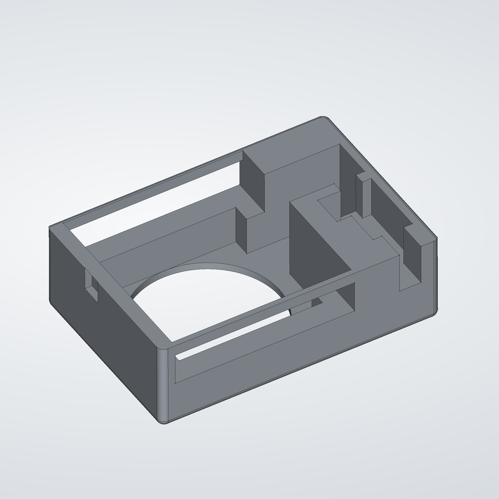
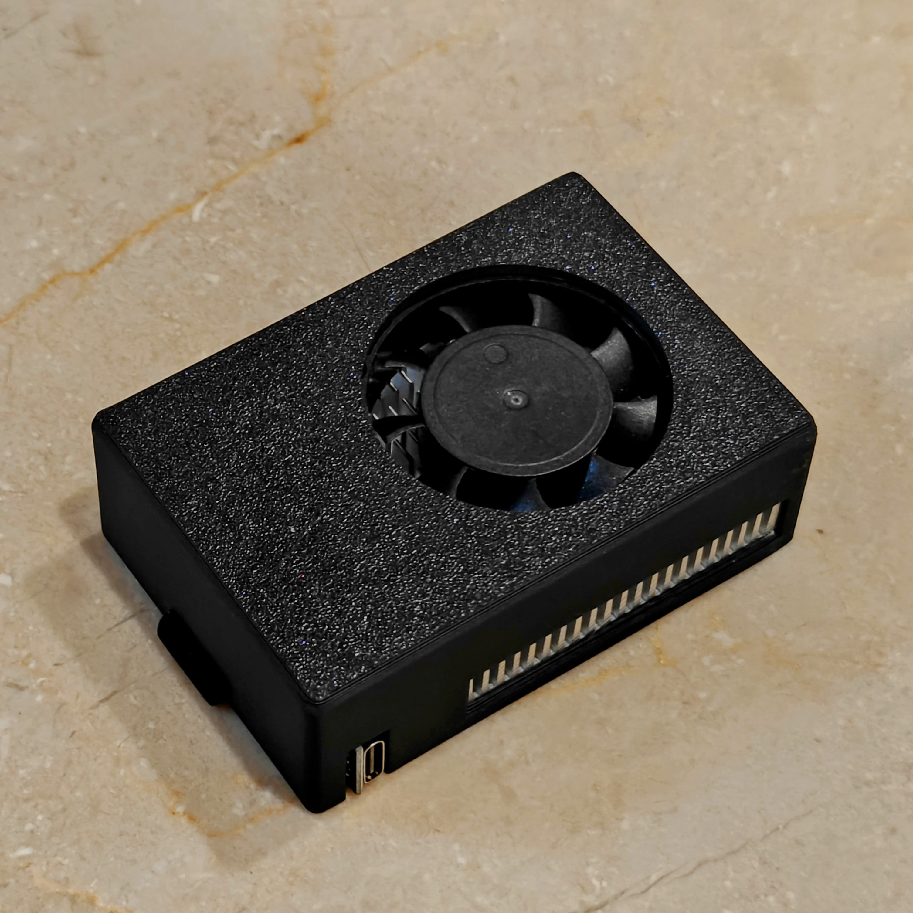
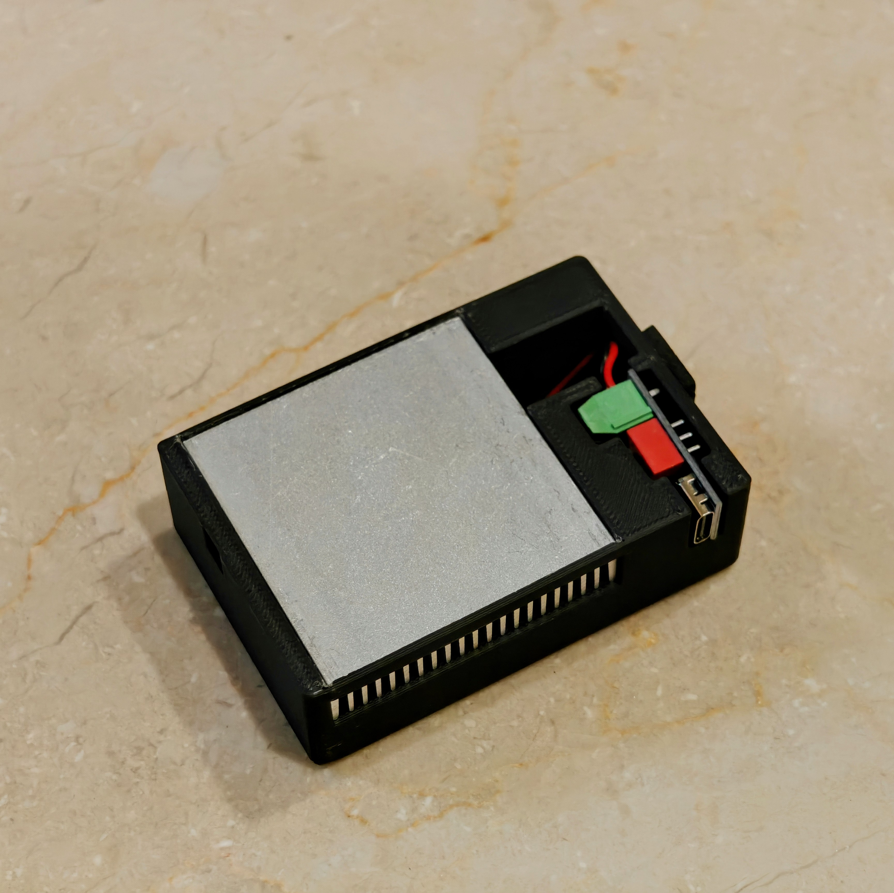
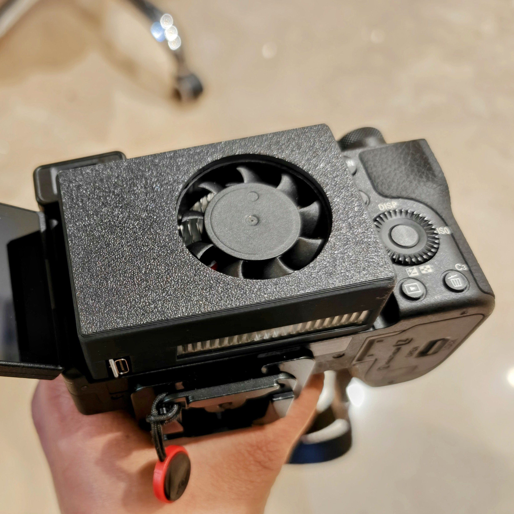
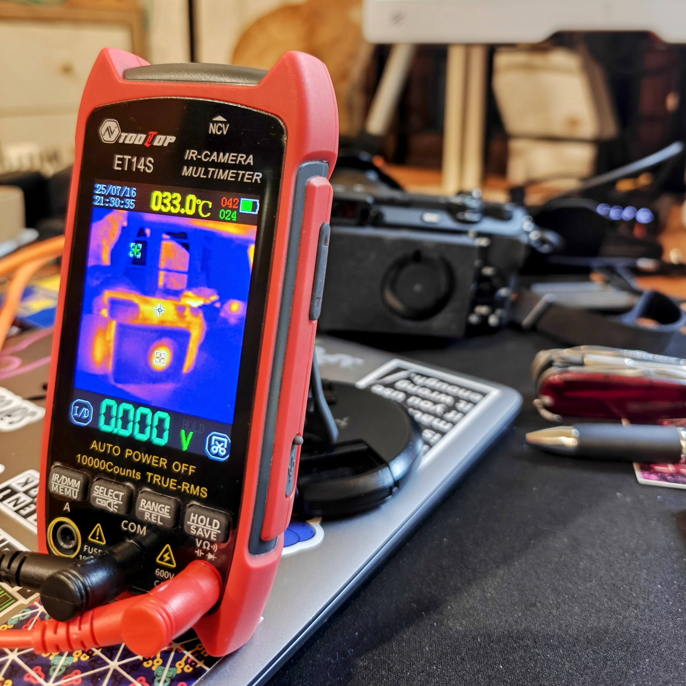
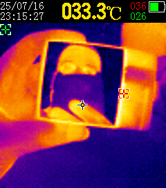

# Camera mounts and accessories

These aren't rackmountable, but are adjacent accessories.

My Sony A6700 camera overheats with auto framing enabled. Camera coolers seem overpriced for what they do, so I made my own. This cooler holds a 4010 fan, a USB-PD trigger decoy board to power it, and a 50x50 mm heatsink that should ideally press onto the camera's surface. It does not have a battery. This model was made to fit the heatsink I had in hand. You may need to tweak the model or file the plastic for yours.

I used this particular USB-PD decoy board because its shape allowed it to be wedged into the case and the screw terminals allowed wiring without soldering.

Print in ABS or PETG. Don't use PLA as the camera can get over 50C. Insert the fan, then the heatsink over it (I got a very snug fit), and wire the fan into the USB-PD trigger, setting the switches for the fan's voltage. For 12V, that's 1-ON, 2-ON, 3-OFF. Drop it into the case and apply tape over it to close. Tape is sufficient as this side will be pressed onto the camera.

The heatsink should sink into the case. Apply a thermal pad over it for better contact with the camera. I didn't have a pad lying around, but I had a suitable piece of copper plate from my last attempt making a heatsink, so I put the copper plate over the aluminimum heatsink with a sandwich filling of thermal paste.

For the final bit, apply a small strip of foam tape on the left side (USB port side) to help wedge it into the display. I used 3mm foam cut to about 5mm width. If you don't have foam tape, use anything compressible, even a piece of cardboard or rubber band.

## BOM

1. 4010 fan, 5V or 12V
2. [USB-PD trigger decoy with dip switches and screw terminals](https://hubtronics.in/usb-c-pd-qc-high-speed-charger-power-delivery-boost-module) ([another source](https://www.amazon.in/Efillooc-Trigger-Charging-Adjustable-Voltage/dp/B0F26BYL87/ref=asc_df_B0F26BYL87))
3. [50x50x11 mm heatsink](https://www.amazon.in/dp/B0F7FBR49R) (aluminium or copper)
4. 50x50 thermal pad or copper plate and thermal paste, for better heat transfer
5. Small piece of foam tape for a secure fit
6. Kapton/polyimide or cellophane tape to cover the USB module

## Images

 
 
 

### Bonus

Copper reflects like a mirror on a thermal camera. Who knew?

