# Cube configurator

FreeCAD model to configure a two-sided rack from 2020 extrusions. Open with FreeCAD 1.0 or later and enter preferences in the spreadsheet.

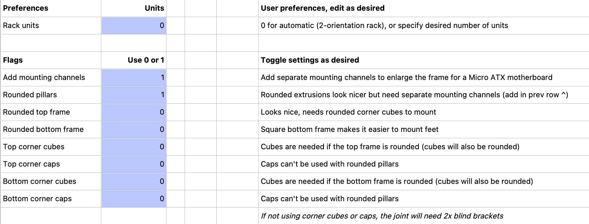

The model will update to reflect the preferences:

| 256mm cube with caps                                                   | Cube with blind brackets                            | Rounded pillars                                          |
| ---------------------------------------------------------------------- | --------------------------------------------------- | -------------------------------------------------------- |
| 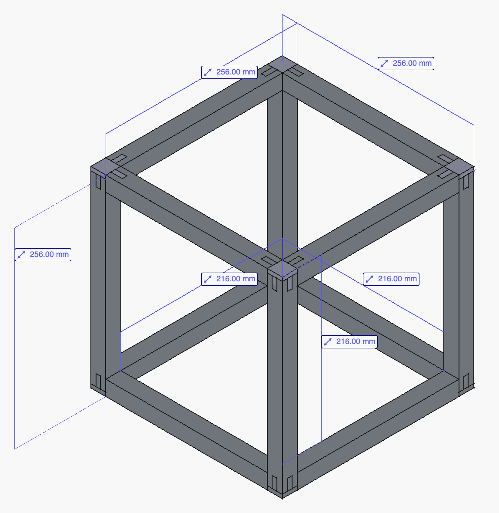                          | 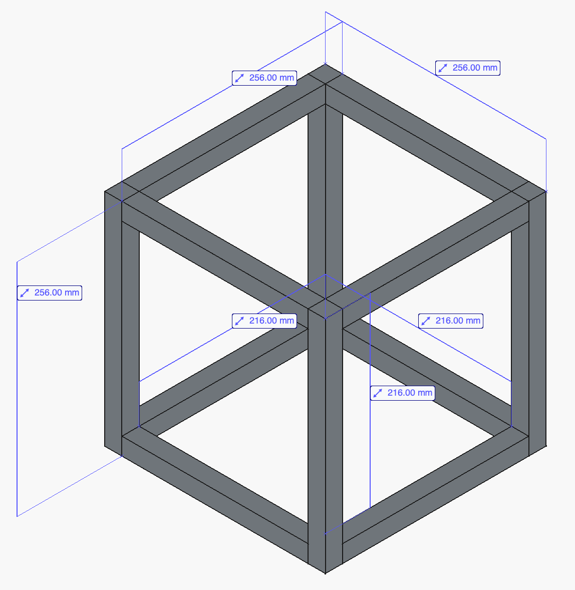 | 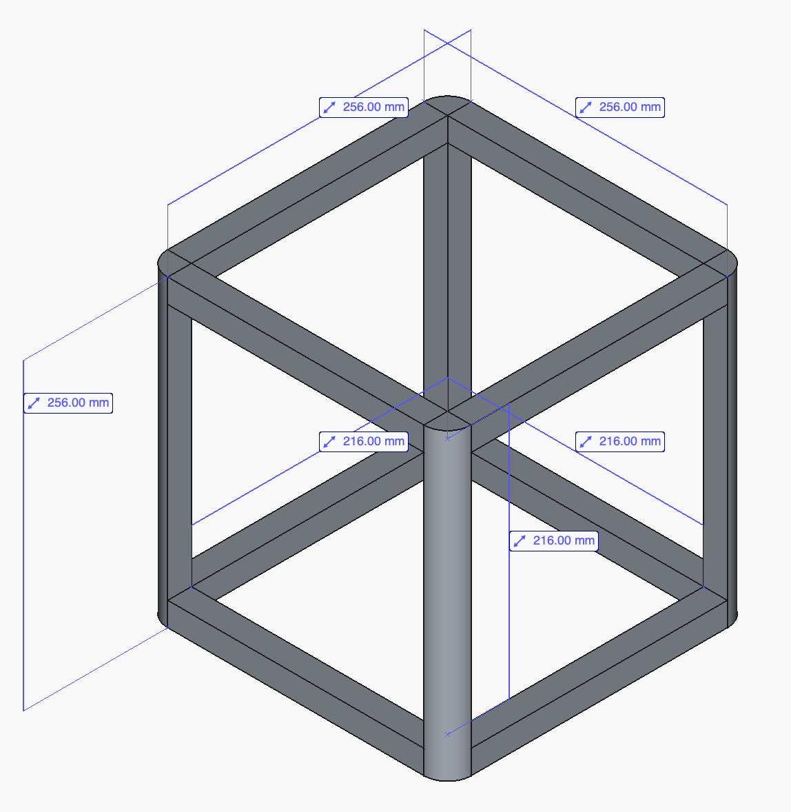      |
| XL for MicroATX motherboard                                            | Rounded top frame                                   | 2U motherboard case                                      |
|  | 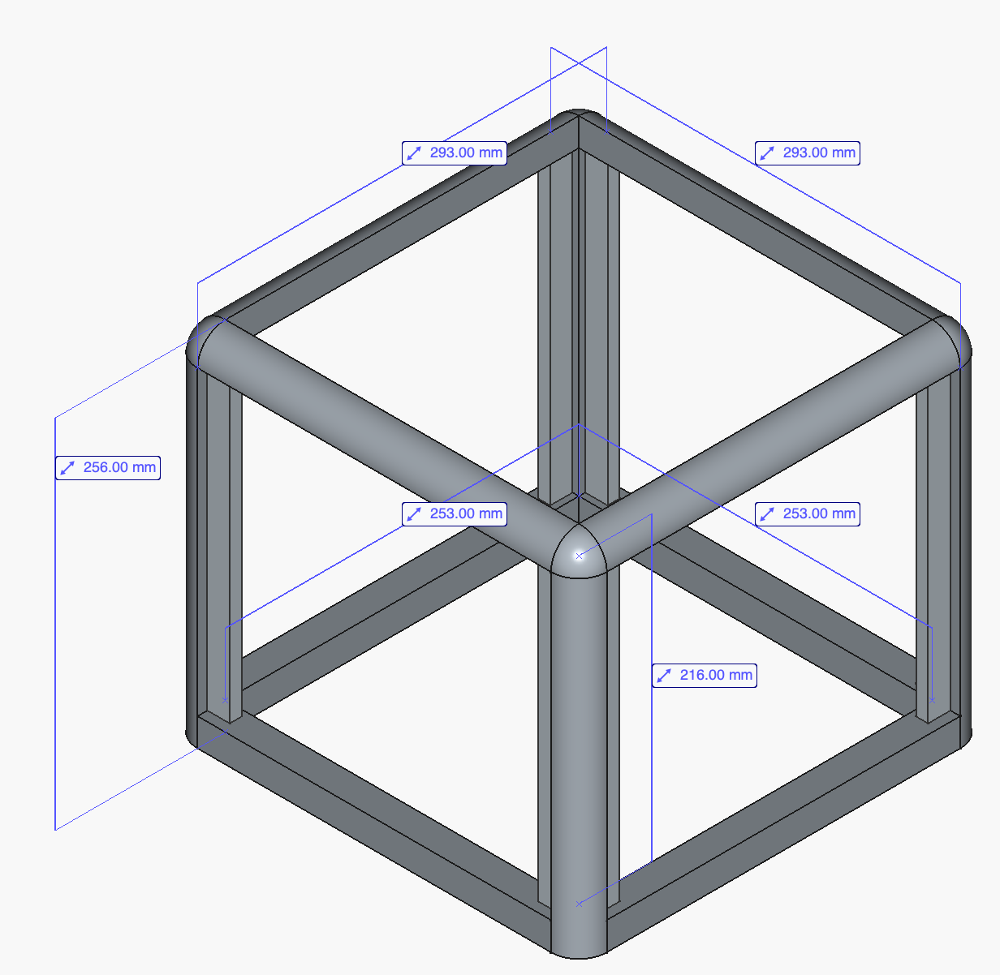  | 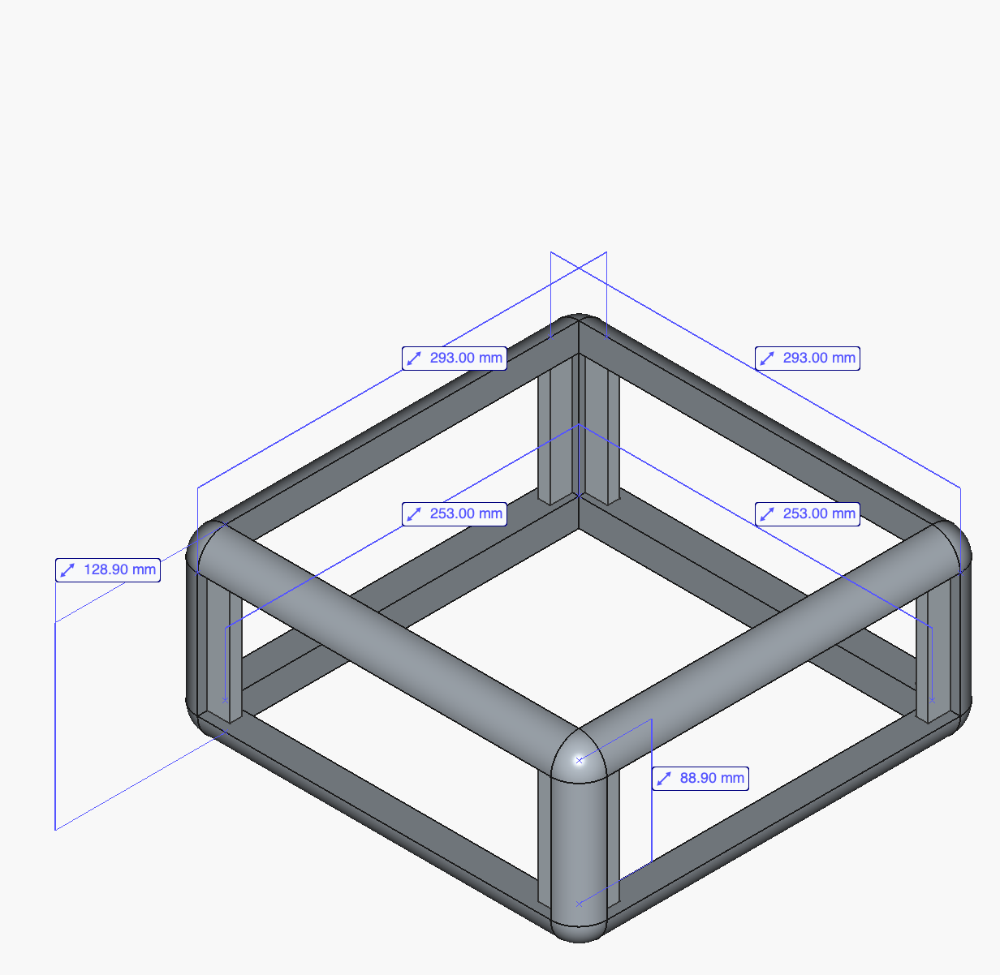 |

Spot invalid combinations like rounded pillars with non-rounded caps:

| Mismatched corner cubes                                          | Rounded corners with square caps                                            |
| ---------------------------------------------------------------- | --------------------------------------------------------------------------- |
|         | 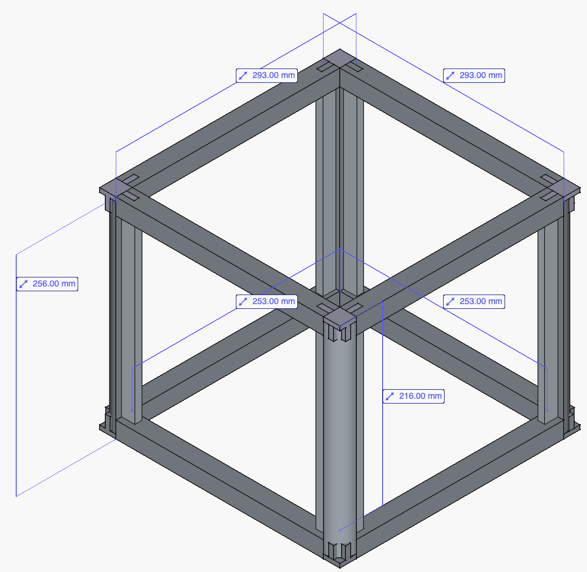        |
| Rounded top-frame with caps                                      | Rounded top-frame with blind brackets                                       |
| 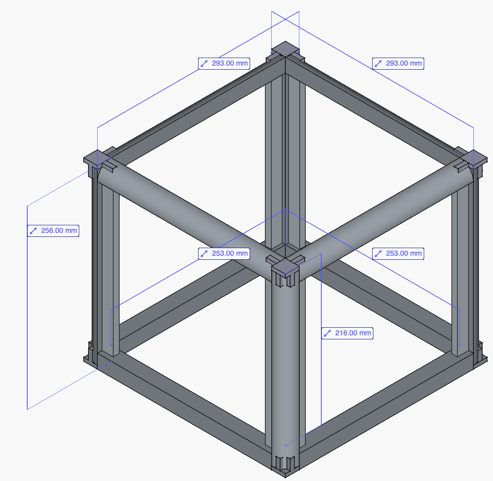 | 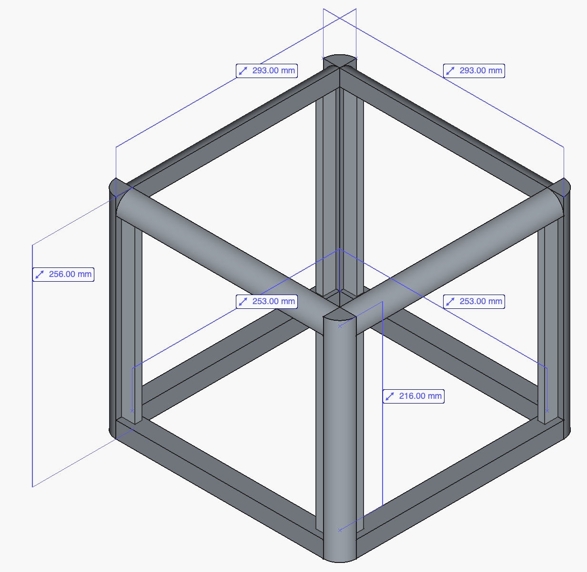 |

The BOM generator shows warnings for some invalid combinations:

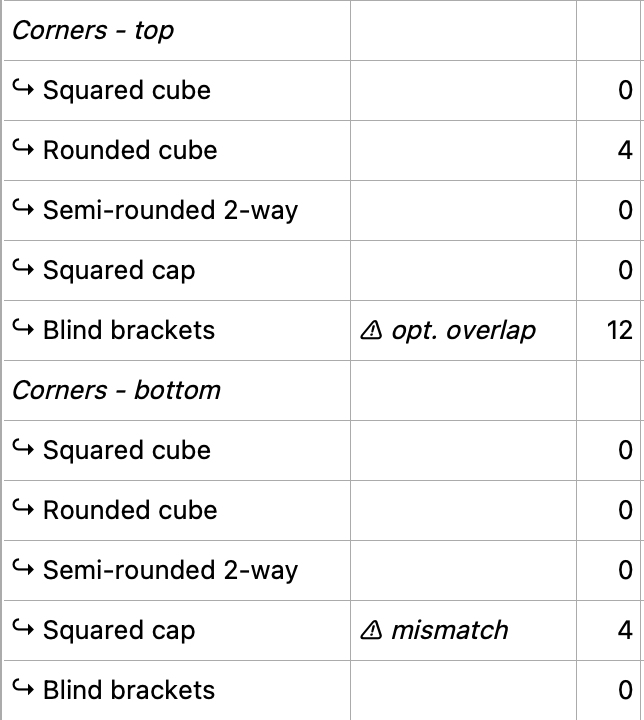

And finally, it also has purchase links with estimated costs (with prices as of 2025-10-15):

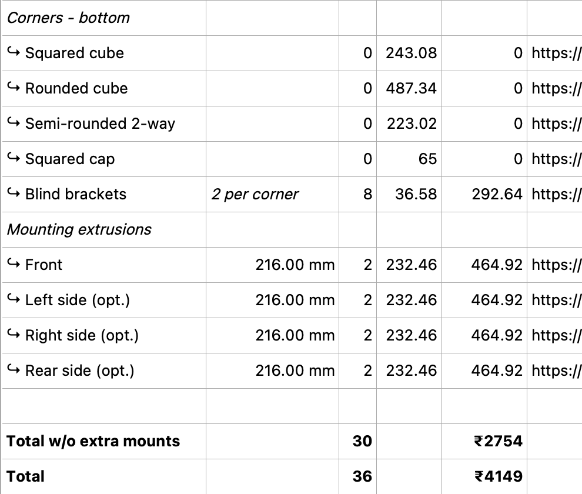
