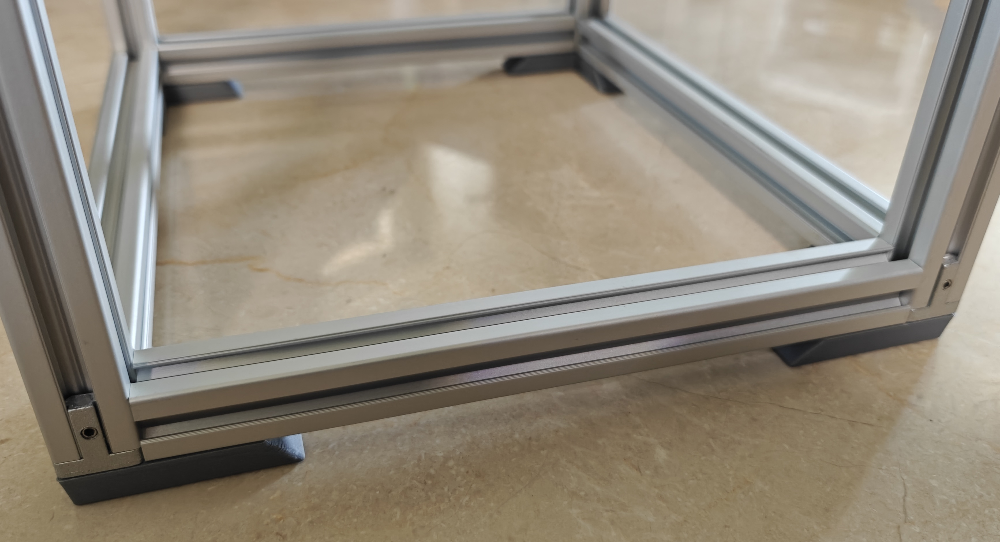
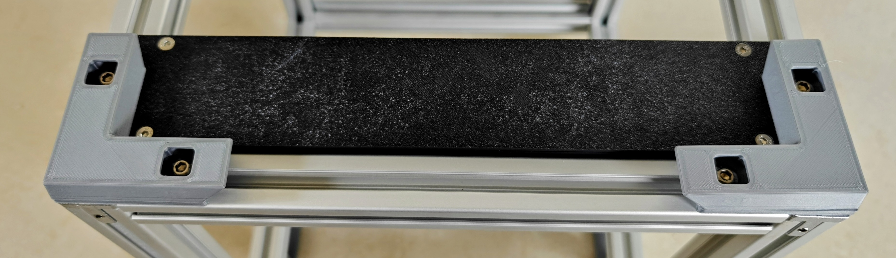

# Rackmount compatible feet and wall hangers

I tried generic rubber feet on my 2020 racks and didn't like them, so I made my own feet. These are L shaped to sit over the corners and they double as wall hangers, for both nail hooks and french cleats. The mounting holes are positioned to sit over the middle hole in a 1U mount, so they can also be stacked over rackmount equipment [such as the PDU](../PDU). 3mm spacers are included for levelling across mounting points.

The STLs folder has feet in 10mm and 20mm sizes. The design is parametric. If you need any other size, open the spreadsheet object in FreeCAD to customize your settings.

Print in any filament, but TPU is recommended. Avoid PLA for wall hangers.

## BOM (set of four feet)

With spacers:

1. 8x M5x10 BHCS (button head) or FHCS (flat head, also known as CSK for "countersunk")
2. 8x M5 t-nuts (leaf or ball spring)

Without spacers:

1. 8x M5x8 BHCS or FHCS
2. 8x M5 t-nuts (hammerhead, leaf or ball spring)

The nuts are interchangeable, but hammerhead t-nuts are fiddly when stacking layers.

