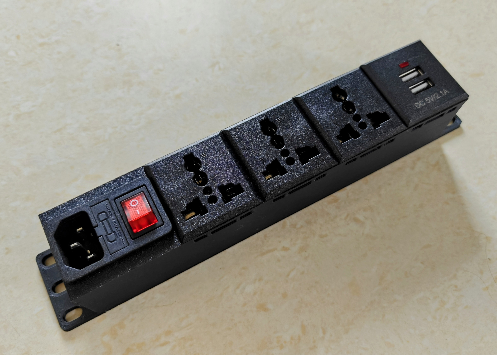

# Power Distribution Unit for a 10" homelab minirack

My rack contains mixed equipment with a variety of power supplies, so I need a generic power strip that's rack-mountable. Since I couldn't find one suitable for a 10" rack and Indian power sockets, here is my design. It fits in 1U and has space for four sockets plus an inlet with a switch and fuse.

There are two printable versions in the STLs folder:

1. Mounted on the bottom or the rear with sockets _facing inward_. I find this better for chargers supplied with European Type C plugs, as they have a loose fit in Indian Type D sockets and will fall out easily.
2. Mounted on the front or rear with sockets _facing outward_. This makes the sockets easier to access and frees up internal space.

Print in PETG or ABS/ASA. Do not use PLA as the inside of a rack can get toasty. The holes for the socket retainer clips require good layer adhesion, which is difficult with ABS/ASA. Apply a dab of cyanoacrylate glue around the pillars to strengthen them if required.

## BOM

1. 6x M3x4x5 brass inserts for mounting the cover plate ([source](https://dc3d.in/shop/hardwares/m3-brass-heat-set-insert/))
2. 6x M3x8 FHCS screws for the cover plate (also labelled CSK for "countersunk"); M3x10 BHCS or SHCS should also work ([source](https://onlyscrews.in/products/hex-allen-csk-m3-x-8-screw-pack-of-20))
3. 1x IEC C14 snap-mount socket with switch and fuse ([source](https://www.amazon.in/gp/product/B09VPL265H))
4. 1-4x MX snap mounting AC socket ([MX-3121 universal](https://mdrelectronics.com/product/mx-snap-mounting-ac-socket-universal-pc-molding-6-amp-250v/) or [MX-3122 Type D](https://mdrelectronics.com/product/mx-snap-mounting-ac-socket-indian-standard-pc-molding-6-amps-250v/))
5. 1-4x USB socket with matching dimensions ([source](https://roboticsdna.in/product/dual-usb-5v-2-1a-dc-charging-power-panel-mount-socket-module/))
6. IEC C13 power cable, L shape preferred ([source 1](https://www.amazon.in/gp/product/B09BMYFWLP), [source 2](https://www.amazon.in/gp/product/B0BBQG59TH))
7. AC-rated electrical wires and fasteners (crimps or soldered), DIY

